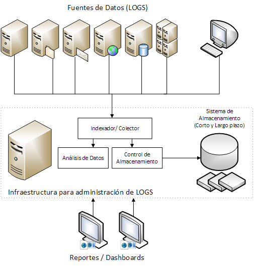

## 1. Logs

**Los logs son registros de los eventos que ocurren dentro de los sistemas informáticos** (máquinas, aplicaciones, redes, etc.). Normalmente son entradas en archivos de texto que contienen información relacionada con un evento específico que ocurrió en un sistema.

Aunque los log fueron utilizados originalmente para la detección y solución de errores, **poseen una gran cantidad de funcionalidades que aportan gran valor**, por ejemplo en procesos de optimización, en registro de acciones de usuarios para auditorias, como fuente de información para investigación de actividades maliciosas, etc.

**La gestión de logs consiste en el proceso de generar, transmitir, almacenar, analizar y permitir el acceso a los datos de los logs** dentro de una organización. La infraestructura que permite la realización de estas operaciones se denomina **Sistema de Gestión de Logs**. Esta infraestructura comprende todo el hardware, software y red de comunicaciones que intervengan en el proceso.

Hoy día, **los sistemas de información están compuestos generalmente por múltiples herramientas que generan gran cantidad de logs**.

**La gestión de los logs puede ser una tarea complicada, confusa y tediosa si no dispone de alguna herramienta o solución específica**.

**Existen numerosas herramientas** que permiten transmitir, almacenar y analizar grandes volúmenes de logs, tanto herramientas que realizan una función determinada como staks que integran varias de esas herramientas específicas para realizar la gestión completa de los logs.

[<<< Volver al índice](README.md)
