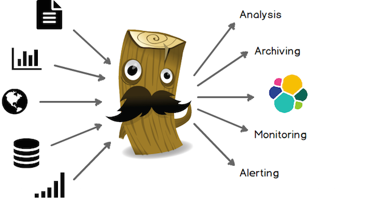
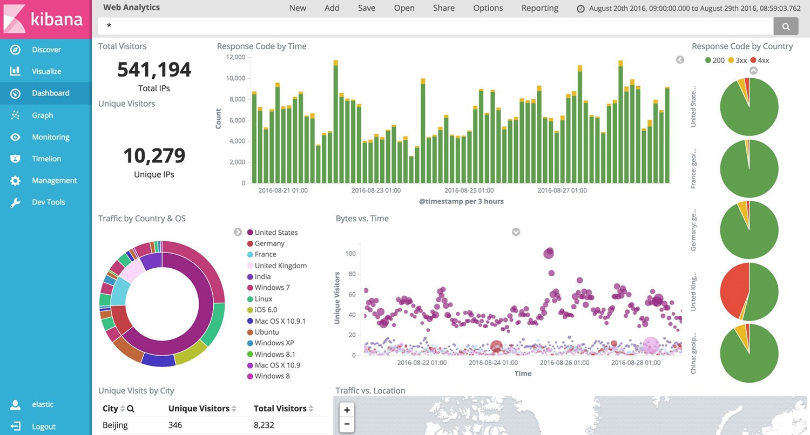

## 6. ELK

Los componentes más importantes de la arquitectura del stack ELK son las siguientes **herramientas de código abierto**:
- **Elasticsearch**
- **Logstash**
- **Kibana**

Estas tres herramientas son proyectos independientes y pueden ser usadas por separado, pero **juntas forman un gran equipo** que permite **leer, almacenar, consultar y monitorizar toda la información que se necesite**.

A diferencia de Graylog2, la versión libre de ELK **no dispone de capacidad para generar alertas**.

### 6.1. Elasticsearch

Elasticsearch es un servidor de búsqueda basado en Lucene que proporciona un **motor de búsqueda de texto completo** (full-text), **fácilmente escalable**, accesible a través de una **interfaz web RESTful**.

Mediante **peticiones HTTP** se puede enviar a Elasticsearch información de forma estructurada para que la indexe y almacene, de modo que puedan realizarse posteriormente búsquedas sobre ella.

Elasticsearch permite **almacenar, buscar y analizar grandes volúmenes de datos de forma muy rápida y en tiempo casi real**. Por defecto, se puede esperar un retraso de un segundo desde el momento en el que el índice se actualiza o borra sus datos hasta el momento en que aparecen los resultados de búsqueda.

**Se utiliza generalmente como tecnología subyacente** para otras funcionalidades más complejas.

Elasticsearch va más allá de la búsqueda por texto gracias a su **lenguaje DSL** (Domain Specific Language) y a una Interfaz de Programación (**API**) para **búsquedas complejas**.

Elasticsearch está construido usando Java y **requiere al menos Java 7** de Oracle o de OpenJDK.

Elasticsearch se basa en los siguientes conceptos: 

- **Clúster**: Un clúster es uno o un conjunto de nodos que mantienen toda la información indexada y distribuida. Cada clúster se identifica por un nombre que, por defecto, es Elasticsearch.

- **Nodo**: Un nodo forma parte de un clúster, almacena información y participa en las tareas de indexación y búsqueda del clúster.

- **Index**: Un index es una colección de documentos con características similares.

- **Sharding**: El sharding es un mecanismo que permite dividir un índice en distintas piezas cuando la información de éste no cabe en un único nodo (máquina), ofreciendo la posibilidad de escalar horizontalmente, además de paralelizar y distribuir las operaciones que realicen sobre el índice.

- **Replicación**: La replicación es un mecanismo que permite que el usuario no se vea afectado en caso de fallo.

### 6.2. Logstash

Logstash es un potente **motor de recopilación de datos** de software libre y código abierto licenciado bajo Apache 2.0, con capacidades de buffering o pipelining en tiempo real. **No es una herramienta de visualización**, y no incluye una interfaz de usuario.

Aunque fue desarrollado inicialmente como herramienta de recopilación y administración de registros de logs, sus capacidades van mucho más allá de ese uso, **aceptando una gran variedad y volumen de datos**.

Puede captar dinámicamente datos de diferentes orígenes (**inputs**), transformarlos, enriquecerlos y normalizarlos en un único modelo (**filters**) y unificarlos y almacenarlos en un único destino (**outputs**), mediante plugins y codecs nativos que simplifican aún más el procesado de datos.

Los flujos de registros **se configuran mediante un archivo de código** que incluye las entradas, las salidas y los filtros (también conocidos como _groks_). Dado que se almacenan en un archivo, pueden estar bajo control de versiones y los cambios se pueden revisar (por ejemplo, como parte de una solicitud Git pull).

Los datos de entrada pueden proceder de fuentes muy diversas, incluyendo algunas tan conocidas como Github, log4j, TCP o Twitter. 

La salida suele ser normalmente una base de datos, aunque también se pueden persistir datos de otras maneras: en plataformas de seguimiento de incidencias como Jira, mediante alertas por email, etc.

Logstash es una herramienta de **fácil instalación**, flexible y sin dependencias. Está escrita en jRuby y se distribuye en un archivo jar que sólo requiere Java para ser instalado.

Se integra muy bien con otros productos Elastic. **Se utiliza comúnmente como parte del stack ELK, aunque también puede funcionar junto con otras herramientas, como Graylog**.

Cuenta con una imagen oficial de Docker, lo que significa que probablemente será bien soportado y mantenido por un tiempo.

### 6.3. Kibana

Kibana, software libre y de código abierto licenciado bajo Apache, es una **plataforma de análisis y visualización** diseñada para trabajar **sobre índices de Elasticsearch**, una herramienta analítica que permite buscar, ver e interactuar con los datos almacenados en los índices de Elasticsearch, facilitando la interpretación de **grandes volúmenes de datos**.

Su **sencilla e intuitiva interfaz gráfica**, basada en navegador web, permite realizar fácilmente **análisis avanzados de datos** y visualizarlos en **tiempo real** en una **amplia variedad de gráficos, tablas y mapas**. Puede crear **cuadros de mando o dashboard** integrales con muchos tipos de widgets.

Kibana es una herramienta de **fácil instalación y configuración**, no requiere ninguna infraestructura adicional, basta con indicar dónde se encuentra Elasticsearch para poder empezar a usarla.

**La versión básica no permite autenticación de usuario**, cualquier usuario puede acceder a todos los registros almacenados en el clúster Elasticsearch. La empresa Elastic ofrece una herramienta de pago para esta funcionalidad.

**En la versión básica tampoco es posible recibir alertas en condiciones específicas**. Sería útil, por ejemplo, poder recibir notificaciones cuando se produce error de conexión a un servidor o a una base de datos, etc. La empresa Elastic ofrece otra herramienta también de pago para esta funcionalidad.

[<<< Volver al índice](README.md)
