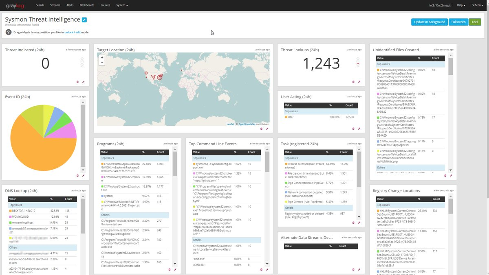

## 7. Graylog2

Los componentes más importantes de la arquitectura del stack Graylog2 son las siguientes **herramientas de código abierto**:
- **graylog-server**: Núcleo de Graylog2 que se encarga de procesar y guardar los mensajes.
- **graylog-web** Interfaz de consulta y configuración del clúster de Graylog2.
- **Elasticsearch**: Sistema de almacenamiento de trazas.
- **MongoDB**: Base de datos de configuración.

Estas herramientas juntas forman un gran equipo que permite leer, almacenar, consultar y monitorizar toda la información que se necesite.

A diferencia de la versión libre de ELK, Graylog2 sí dispone de capacidad para definir alarmas sobre la presencia o ausencia de información, etc.

Graylog2 proporciona, entre otras, las siguientes prestaciones:

- **Centralizar el almacenamiento** de trazas de todos los sistemas.
- **Aumentar la calidad de las trazas** con niveles, eventos, métricas de negocio ...
- **Reducir el volumen de trazas en disco** en los propios servidores.
- **Facilitar el soporte a incidencias** mediante una sencilla interfaz web de consulta con filtros, gráficas, segmentación de resultados por atributos, exportación de los datos ...
- **Disponer de cuadros de mando** con métricas extraídas directamente de las trazas.

**Ventajas**:

- Es software **libre y de código abierto**, licenciado bajo GNU GPL v3.
- Mantiene la información actualizada en **tiempo real**.
- Es de **fácil instalación y configuración**, se puede instalar rápidamente en cualquier máquina Linux con Java 7 y configurar dependencias remotas y graylog2 a través de una interfaz web.
- Proporciona una **gran interfaz**, fácil, intuitiva y llena de anotaciones y explicaciones.
- Puede crear **dashboard** con varios tipos widgets.
- **Funciona bien con casi cualquier tipo de registro**.
- Necesita **poco mantenimiento**.
- Se pueden **identificar eventos en tiempo real y realizar acciones**, como alertas de problemas o mensajes directos.
- La funcionalidad del servidor se puede **extender a través de plug-ins**.

**Inconvenientes**:

- El soporte de **protocolos de registro es limitado**, Graylog2 sólo soporta protocolos syslog y GELF. 
- **No hay mucha variedad de widgets.**
