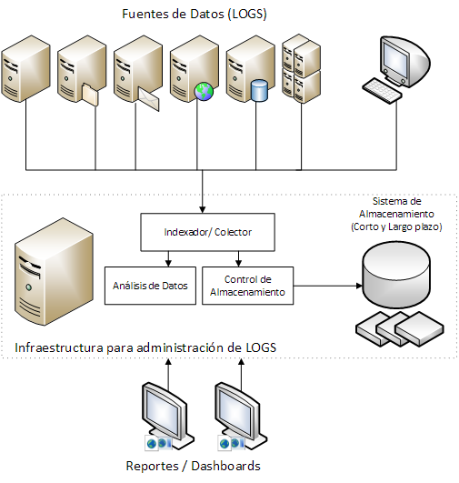
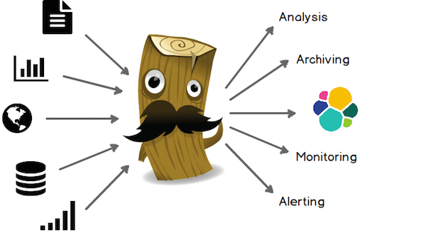
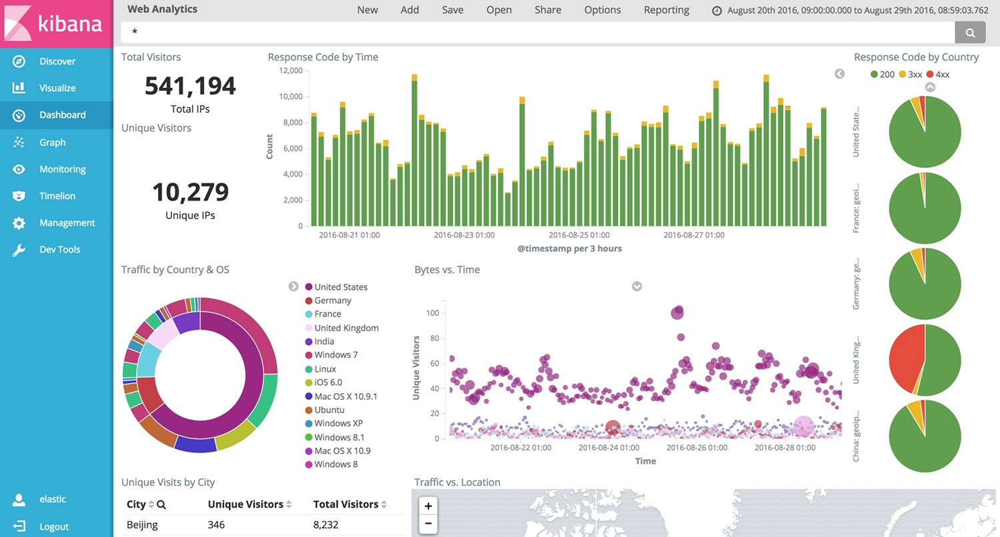

# Almacenamiento y monitorización de logs

## Índice

1. 
2. Recolección de logs
3. Almacenamiento de logs
4. Análisis y monitorización de logs
5. Stacks de Gestión de logs
6. ELK
    1. Elasticsearch
    2. Logstash
    3. Kibana
7. Graylog2
8. Conclusión
9. Referencias

## 1. Logs

**Los logs son registros de los eventos que ocurren dentro de los sistemas informáticos** (máquinas, aplicaciones, redes, etc.). Normalmente son entradas en archivos de texto que contienen información relacionada con un evento específico que ocurrió en un sistema.

Aunque los log fueron utilizados originalmente para la detección y solución de errores, **poseen una gran cantidad de funcionalidades que aportan gran valor**, por ejemplo en procesos de optimización, en registro de acciones de usuarios para auditorias, como fuente de información para investigación de actividades maliciosas, etc.

**La gestión de logs consiste en el proceso de generar, transmitir, almacenar, analizar y permitir el acceso a los datos de los logs** dentro de una organización. La infraestructura que permite la realización de estas operaciones se denomina **Sistema de Gestión de Logs**. Esta infraestructura comprende todo el hardware, software y red de comunicaciones que intervengan en el proceso.

Hoy día, **los sistemas de información están compuestos generalmente por múltiples herramientas que generan gran cantidad de logs**.

**La gestión de los logs puede ser una tarea complicada, confusa y tediosa si no dispone de alguna herramienta o solución específica**.

**Existen numerosas herramientas** que permiten transmitir, almacenar y analizar grandes volúmenes de logs, tanto herramientas que realizan una función determinada como staks que integran varias de esas herramientas específicas para realizar la gestión completa de los logs.

## 2. Recolección de logs

Entre las herramientas de recolección de logs (y de datos en general) se encuentran **Logstash**, **Filebeat**, **Logagent**, **Rsyslog**, **Syslog-ng**, **Fluentd**, **NXLOG** o **Graylog Collector** entre otras.

Cada una de ellas cuenta con ventajas e inconvenientes. La elección de una u otra dependerá de las especificaciones del caso de uso y de las preferencias personales.

A continuación se indican algunas fortalezas y debilidades de varias de estas herramientas.

- **Logstash**:

    - _Fortalezas_: El principal punto fuerte de Logstash es su flexibilidad, por el gran número de plugins desarrollados. La mayoría de los plugins están en Ruby y son muy fáciles de escribir, por lo que hay un gran número de ellos, hay un plugin casi para cualquier origen y destino. Su documentación es clara y su configuración sencilla, por lo que se emplea en una gran variedad de casos de uso. Además, se puede encontrar información en Internet para hacer prácticamente cualquier cosa.

    - _Debilidades_: El talón de Aquiles de Logstash siempre ha sido el rendimiento y el consumo de recursos. Aunque el rendimiento ha mejorado mucho a lo largo de los años, sigue siendo más lento que otras alternativas, lo que puede constituir un problema para implementaciones con elevado tráfico. Otro problema es que Logstash no almacena los datos, por lo que se pierden si el destino no está accesible. Una solución típica es utilizar Kafka o Redis como búfer central. 

- **Filebeat**:

    - _Fortalezas_: Se distribuye como un pequeño binario sin dependencias, necesita muy pocos recursos y es bastante fiable.
    
    - _Debilidades_: Su alcance es muy limitado.

- **Logagent**: 
    
    - _Fortalezas_: Es fácil de usar, aún mas que Logstash, ligero y rápido. Analiza diferentes formatos de registro (Elasticsearch, Solr, MongoDB, Apache HTTPD ...). Puede enmascarar datos sensibles como fecha de nacimiento, números de tarjetas de crédito, etc. Tiene localización geográfica por IP (GeoIP). Cuenta con un búfer local, por lo que, a diferencia de Logstash, no se pierden registros cuando el destino no está disponible.
    
    - _Debilidades_: Es una herramienta joven, incluye alguna funcionalidad interesante pero aún no es tan flexible como Logstash.

- **Rsyslog**
    
    - _Fortalezas_: Rsyslog es uno de los recolectores más rápidos y ligeros. Su módulo de análisis funciona a velocidad constante sin importar el número de reglas.
    
    - _Debilidades_: Es difícil obtener una configuración correcta y estable. Es difícil navegar por su documentación. Su formato de configuración cambió tras la versión 5 y hay incompatibilidades para algunos plugins.

- **Syslog-ng**:
    
    - _Fortalezas_: Es un recolector ligero (como Rsyslog). Cuenta con un formato de configuración claro y consistente y tiene una buena documentación, a diferencia de Rsyslog.
    
    - _Debilidades_: Su rendimiento final no llega al de Rsyslog.

- **Fluentd**:
    
    - _Fortalezas_: La mayoría de los plugins están en Ruby y son muy fáciles de escribir, por lo que hay un gran número de ellos, hay un plugin casi para cualquier origen y destino.
    
    - _Debilidades_: Fluentd no proporciona la misma flexibilidad en la estructura de los datos que otras herramientas. 

- **NXLOG**: 
    
    - _Fortalezas_: Ofrece soporte nativo para sistemas Windows, permitiendo así una única herramienta para la transmisión de logs y consiguiendo reducir significativamente la complejidad de la gestión de logs en sistemas heterogéneos Unix/Linux/Windows. Soporta el protocolo GELF.

- **Graylog Collector**: 
    
    - Graylog Collector es una aplicación Java ligera que te permite reenviar datos de los archivos de registro a un clúster Graylog. El recopilador puede leer los archivos de registro local y también los eventos de Windows de forma nativa. Luego puede reenviar los mensajes de registro a través de la red utilizando el formato GELF.
    
    - _Debilidades_: Está deprecado.

## 3. Almacenamiento de logs

Para el almacenamiento de los logs hay múltiples opciones.

- **Almacenamiento en ficheros**:
    
    - Habitualmente los logs se almacenan en primera instancia en archivos en el propio disco de la máquina que los genera, de la máquina donde se encuentra instalada la aplicación, etc., o incluso enviados por red a otros servidores de almacenamiento.
    
    - Dado que el almacenamiento ha sido tradicionalmente limitado, estos archivos suelen rotarse por tamaño (cuando alcanzan un volumen determinado) o por tiempo (cada hora, cada día, cada semana...), con la consiguiente pérdida de información.

- **Almacenamiento en bases de datos relacionales**:
    
    - Los logs pueden ser enviados a bases de datos relacionales como medio de almacenamiento para poder analizarlos posteriormente.
    
    - Este sistema de almacenamiento y explotación no es muy eficiente cuando se tiene que gestionar grandes volúmenes de logs que se generan a altas velocidades, pues las bases de datos relacionales no escalan lo suficiente.

- **Almacenamiento en bases de datos NoSql**: 
    
    - Las bases de datos NoSql vienen a solventar el problema de volumen, velocidad y escalabilidad de las bases de datos tradicionales, permitiendo almacenar grandes volúmenes de datos a velocidades muy altas, escalando fácilmente y a menor coste cuando se necesita.
    
    - Por otro lado se encuentran los motores de indexación como Elasticsearch, sistemas que permiten indexar y almacenar muy rápidamente grandes volúmenes de información, incluso servir como motores de indexación de otras bases de datos.

## 4. Análisis y monitorización de logs

- **Kibana**:
    
    - Kibana es una plataforma de análisis y visualización de datos diseñada para trabajar con índices de Elasticsearch sobre los que se pueden realizar búsquedas e interactuaciones, facilitando la interpretación de grandes volúmenes de datos.
    
    - Es de fácil instalación y configuración, y su sencilla e intuitiva interfaz gráfica, basada en navegador web, permite realizar fácilmente análisis avanzados de datos y visualizarlos en tiempo real en una amplia variedad de gráficos, tablas y mapas. Puede crear cuadros de mando o dashboard integrales con muchos tipos de widgets.
    
    - La versión básica no permite autenticación de usuario ni generación de alertas, aunque la empresa Elastic ofrece otras herramientas de pago para estas funcionalidades.

- **Interfaz gráfica de Graylog2**:
    
    - La interfaz de usuario de Graylog2, integrada en el stack de Graylog2, es una herramienta de análisis y visualización de datos que, al igual que Kibana, permite interactuar con índices de Elasticsearch para realizar búsquedas e interactuaciones, facilitando la interpretación de grandes volúmenes de datos.    
    
    - Ventajas de Graylog2 sobre la versión libre de Kibana son que Graylog2 permite autenticación de usuario y generación de alertas. Por contra, el número de widgets es más reducido.

- **_Otras herramientas de visualización y monitorización_**:

    - **Tableau**: Tableau ayuda a transformar los datos en información útil con análisis visuales, diseñando dashboards y analizando ad hoc con unos pocos clics.

    - **Pentaho Dashboard**: Es una plataforma integrada para proporcionar información sobre los datos, donde se pueden ver informes, gráficos interactivos y los cubos creados con las herramientas Pentaho Report Designer.

    - **AWStats**: Herramienta gratuita que sirve para analizar logs de servidores web, de correo electrónico y de ftp. Realiza un análisis muy bueno de los visitantes únicos y de las visitas que hacen los robots, que suelen generar cierto descontrol en los resultados.

    - **Free-SA**: Está más pensado para la evaluación del rendimiento del servidor y su seguridad, pero da una resultados muy relevantes.

    - **W3Perl**: Aplicación gratuita que se instala en el servidor. Está preparada para trabajar con Linux (Tarball, RPM, SRPM y Debian/Ubuntu), Windows (IIS, Apache, Abyss) y Mac. Tiene una versión para funcionar sin servidor (offline).

    - **Visitors**: Es una forma diferente de trabajar con ficheros log, ya que lo que hace es generar un grafo con las conexiones realizadas por los usuarios. Aunque también ofrece un análisis estadístico y varios tipos de informes.

    - _Otras_: **Web Expert Lite**, **The Webalizer**, **AlterWind**...
    
    - _Herramientas ad-hoc_ desarrolladas ex profeso con tecnologías javascript como **Higcharts**, **Google**, **ChartJS**, **NVD3**, **D3**, etc

## 5. Stacks de Gestión de logs

Existen también **soluciones de almacenamiento centralizado y monitorización de logs** que integran en un único paquete todas las herramientas necesarias para la gestión de logs.

Los stack **ELK** y **Graylog2** son dos de estas soluciones más populares, dos proyectos de código abierto distintos pero similares en concepto, dos herramientas que pueden utilizarse en la recogida, almacenamiento y monitorización de logs de todo tipo: logs de sistema, de aplicaciones, de dispositivos...

Ambas herramientas permiten **reunir todos los logs de una arquitectura compleja en un mismo lugar** en vez de tenerlos repartidos por decenas de servidores y rutas. Además, ya que todas las trazas acaban almacenadas en el mismo lugar y es sencillo navegar por ellas, es muy fácil **aumentar la calidad** de estas revisándolas.

Además de procesar y almacenar logs, ELK y Graylog2 permiten realizar consultas sobre los datos y crear **paneles gráficos o dashboards** con los resultados de dichas consultas.

**ELK** está formado por tres herramientas: Logstash para la captación de datos, Elasticsearch para el almacenamiento e indexación de los datos y Kibana para la explotación y visualización de los datos.

**Graylog2** puede recibir datos de diferentes orígenes y distintos protocolos, los procesa y se apoya en Elasticsearch para su almacenamiento e indexación. Su interfaz gráfica permite posteriormente la explotación y visualización de los datos.

Graylog2 permite además, a **diferencia** de la versión libre de ELK, definir alarmas sobre la presencia o ausencia de información. Por contra, Kibana (ELK) dispone de mayor variedad de tipos de gráficos.

Ante cualquier escenario **es recomendable explorar distintas soluciones entes de tomar una decisión**.

## 6. ELK

Los componentes más importantes de la arquitectura del stack ELK son las siguientes **herramientas de código abierto**:
- **Elasticsearch**
- **Logstash**
- **Kibana**

Estas tres herramientas son proyectos independientes y pueden ser usadas por separado, pero **juntas forman un gran equipo** que permite **leer, almacenar, consultar y monitorizar toda la información que se necesite**.

A diferencia de Graylog2, la versión libre de ELK **no dispone de capacidad para generar alertas**.

### 6.1. Elasticsearch

Elasticsearch es un servidor de búsqueda basado en Lucene que proporciona un **motor de búsqueda de texto completo** (full-text), **fácilmente escalable**, accesible a través de una **interfaz web RESTful**.

Mediante **peticiones HTTP** se puede enviar a Elasticsearch información de forma estructurada para que la indexe y almacene, de modo que puedan realizarse posteriormente búsquedas sobre ella.

Elasticsearch permite **almacenar, buscar y analizar grandes volúmenes de datos de forma muy rápida y en tiempo casi real**. Por defecto, se puede esperar un retraso de un segundo desde el momento en el que el índice se actualiza o borra sus datos hasta el momento en que aparecen los resultados de búsqueda.

**Se utiliza generalmente como tecnología subyacente** para otras funcionalidades más complejas.

Elasticsearch va más allá de la búsqueda por texto gracias a su **lenguaje DSL** (Domain Specific Language) y a una Interfaz de Programación (**API**) para **búsquedas complejas**.

Elasticsearch está construido usando Java y **requiere al menos Java 7** de Oracle o de OpenJDK.

Elasticsearch se basa en los siguientes conceptos: 

- **Clúster**: Un clúster es uno o un conjunto de nodos que mantienen toda la información indexada y distribuida. Cada clúster se identifica por un nombre que, por defecto, es Elasticsearch.

- **Nodo**: Un nodo forma parte de un clúster, almacena información y participa en las tareas de indexación y búsqueda del clúster.

- **Index**: Un index es una colección de documentos con características similares.

- **Sharding**: El sharding es un mecanismo que permite dividir un índice en distintas piezas cuando la información de éste no cabe en un único nodo (máquina), ofreciendo la posibilidad de escalar horizontalmente, además de paralelizar y distribuir las operaciones que realicen sobre el índice.

- **Replicación**: La replicación es un mecanismo que permite que el usuario no se vea afectado en caso de fallo.

### 6.2. Logstash

Logstash es un potente **motor de recopilación de datos** de software libre y código abierto licenciado bajo Apache 2.0, con capacidades de buffering o pipelining en tiempo real. **No es una herramienta de visualización**, y no incluye una interfaz de usuario.

Aunque fue desarrollado inicialmente como herramienta de recopilación y administración de registros de logs, sus capacidades van mucho más allá de ese uso, **aceptando una gran variedad y volumen de datos**.

Puede captar dinámicamente datos de diferentes orígenes (**inputs**), transformarlos, enriquecerlos y normalizarlos en un único modelo (**filters**) y unificarlos y almacenarlos en un único destino (**outputs**), mediante plugins y codecs nativos que simplifican aún más el procesado de datos.

Los flujos de registros **se configuran mediante un archivo de código** que incluye las entradas, las salidas y los filtros (también conocidos como _groks_). Dado que se almacenan en un archivo, pueden estar bajo control de versiones y los cambios se pueden revisar (por ejemplo, como parte de una solicitud Git pull).

Los datos de entrada pueden proceder de fuentes muy diversas, incluyendo algunas tan conocidas como Github, log4j, TCP o Twitter. 

La salida suele ser normalmente una base de datos, aunque también se pueden persistir datos de otras maneras: en plataformas de seguimiento de incidencias como Jira, mediante alertas por email, etc.

Logstash es una herramienta de **fácil instalación**, flexible y sin dependencias. Está escrita en jRuby y se distribuye en un archivo jar que sólo requiere Java para ser instalado.

Se integra muy bien con otros productos Elastic. **Se utiliza comúnmente como parte del stack ELK, aunque también puede funcionar junto con otras herramientas, como Graylog**.

Cuenta con una imagen oficial de Docker, lo que significa que probablemente será bien soportado y mantenido por un tiempo.

### 6.3. Kibana

Kibana, software libre y de código abierto licenciado bajo Apache, es una **plataforma de análisis y visualización** diseñada para trabajar **sobre índices de Elasticsearch**, una herramienta analítica que permite buscar, ver e interactuar con los datos almacenados en los índices de Elasticsearch, facilitando la interpretación de **grandes volúmenes de datos**.

Su **sencilla e intuitiva interfaz gráfica**, basada en navegador web, permite realizar fácilmente **análisis avanzados de datos** y visualizarlos en **tiempo real** en una **amplia variedad de gráficos, tablas y mapas**. Puede crear **cuadros de mando o dashboard** integrales con muchos tipos de widgets.

Kibana es una herramienta de **fácil instalación y configuración**, no requiere ninguna infraestructura adicional, basta con indicar dónde se encuentra Elasticsearch para poder empezar a usarla.

**La versión básica no permite autenticación de usuario**, cualquier usuario puede acceder a todos los registros almacenados en el clúster Elasticsearch. La empresa Elastic ofrece una herramienta de pago para esta funcionalidad.

**En la versión básica tampoco es posible recibir alertas en condiciones específicas**. Sería útil, por ejemplo, poder recibir notificaciones cuando se produce error de conexión a un servidor o a una base de datos, etc. La empresa Elastic ofrece otra herramienta también de pago para esta funcionalidad.

## 7. Graylog2

Los componentes más importantes de la arquitectura del stack Graylog2 son las siguientes **herramientas de código abierto**:
- **graylog-server**: Núcleo de Graylog2 que se encarga de procesar y guardar los mensajes.
- **graylog-web** Interfaz de consulta y configuración del clúster de Graylog2.
- **Elasticsearch**: Sistema de almacenamiento de trazas.
- **MongoDB**: Base de datos de configuración.

Estas herramientas juntas forman un gran equipo que permite leer, almacenar, consultar y monitorizar toda la información que se necesite.

A diferencia de la versión libre de ELK, Graylog2 sí dispone de capacidad para definir alarmas sobre la presencia o ausencia de información, etc.

Graylog2 proporciona, entre otras, las siguientes prestaciones:

- **Centralizar el almacenamiento** de trazas de todos los sistemas.
- **Aumentar la calidad de las trazas** con niveles, eventos, métricas de negocio ...
- **Reducir el volumen de trazas en disco** en los propios servidores.
- **Facilitar el soporte a incidencias** mediante una sencilla interfaz web de consulta con filtros, gráficas, segmentación de resultados por atributos, exportación de los datos ...
- **Disponer de cuadros de mando** con métricas extraídas directamente de las trazas.

**Ventajas**:

- Es software **libre y de código abierto**, licenciado bajo GNU GPL v3.
- Mantiene la información actualizada en **tiempo real**.
- Es de **fácil instalación y configuración**, se puede instalar rápidamente en cualquier máquina Linux con Java 7 y configurar dependencias remotas y graylog2 a través de una interfaz web.
- Proporciona una **gran interfaz**, fácil, intuitiva y llena de anotaciones y explicaciones.
- Puede crear **dashboard** con varios tipos widgets.
- **Funciona bien con casi cualquier tipo de registro**.
- Necesita **poco mantenimiento**.
- Se pueden **identificar eventos en tiempo real y realizar acciones**, como alertas de problemas o mensajes directos.
- La funcionalidad del servidor se puede **extender a través de plug-ins**.

**Inconvenientes**:

- El soporte de **protocolos de registro es limitado**, Graylog2 sólo soporta protocolos syslog y GELF. 
- **No hay mucha variedad de widgets.**

## 8. Conclusión

La gestión de logs engloba un conjunto de técnicas y operaciones que afectan a toda la infraestructura de un sistema de información. Los protocolos de comunicaciones, la naturaleza de los dispositivos generadores de registros, la propia red de comunicaciones, formatos de mensajes, transmisión de grandes volúmenes de datos, almacenamiento eficiente... Son muchos los factores a tener en cuenta a la hora de construir una plataforma de gestión de logs

Una solución consiste en dividir el problema en componentes aislados con una funcionalidad específica y empezar a montar un sistema de gestión de logs desde cero. Existen también soluciones que integran herramientas para cada una de las funcionalidades y facilitan el proceso, pero, a su vez, permiten el desacople de sus componentes y para poder ser reemplazados por otros.

Cada solución cuenta con ventajas e inconvenientes. La elección dependerá de las especificaciones del caso de uso y de las preferencias personales.

### 8.1. Elección

Se ha determinado que **Logstash**, para la recogida e ingesta de logs, y el stack **Graylog2**, para el almacenamiento, indexación y análisis, son una buena elección para el prototipo del que es objeto este trabajo.

Logstash es un producto robusto y consolidado, flexible, con gran número de plugins, documentación clara y una velocidad más que suficiente para el tráfico del caso de uso concreto.

Graylog2 es también un producto robusto y consolidado, integra almacenamiento e indexación con Elasticsearch y proporciona una interfaz sencilla y potente que permite monitorizar los procesos, crear cuadros de mando y alertar de las situaciones que sea necesario.

## 9. Referencias
- Administración de LOGS:
    - Administración de LOGS:
		- https://manuelvieda.com/blog/administracion-de-logs/
    - Sácale partido a los datos: los ficheros log:
		- http://tecnologiasweb.jsenso.es/los-ficheros-log/
    - Logstash vs Graylog2:
		- https://www.slant.co/versus/958/965/~logstash_vs_graylog2
    - Log Management: Graylog Vs ELK:
		- http://jetruby.com/expertise/graylog-vs-elk/

- ELK:
    - The Complete Guide to the ELK Stack:
		- https://logz.io/learn/complete-guide-elk-stack/
    - Introducción a ELK (Elasticsearch, Logstash y Kibana) (parte 1):
		- http://elmanytas.es/?q=node/318
    - Introducción a ELK (Elasticsearch, Logstash y Kibana) (parte 2):
		- http://elmanytas.es/?q=node/320
    - Introducción a ELK (Elasticsearch, Logstash y Kibana) (parte 3):
		- http://elmanytas.es/?q=node/326
    - Monitorización de logs con el stack ELK (Elasticsearch, logstash y Kibana):
		- http://developerlover.com/monitorizacion-logs-stack-elk-elasticsearch-logstash-kibana/
    - Tratamiento de Logs masivos:
		- https://www.libreadmin.es/tratamiento-de-logs/

- Graylog2:
    - Graylog2:
		- https://www.graylog.org/
    - Architectural considerations:
		- http://docs.graylog.org/en/1.0/pages/architecture.html#minimum-setup
    - Graylog - Arquitectura tolerante a fallos y escalable:
		- http://javierjeronimo.es/2015/03/23/graylog-arquitectura-tolerante-a-fallos-y-escalable/
    - 250 GB/day of logs with Graylog: Lessons Learned:
		- https://thehftguy.com/2016/09/12/250-gbday-of-logs-with-graylog-the-good-the-bad-and-the-ugly/
    - Zimbra: Logs centralizados con Logstash y Kibana sobre Ubuntu 14.04:
		- https://www.jorgedelacruz.es/2014/12/16/zimbra-logs-centralizados-con-logstash-y-kibana-sobre-ubuntu-14-04/
    - Setting up a Graylog Log Management Server:
		- https://tom-henderson.github.io/2015/04/15/graylog.html
    - Logstash + graylog2 – cant ask more for logging:
		- https://boojapathy.wordpress.com/2012/04/29/logstash-graylog-cant-ask-more-for-logging/
    - Graylog Collector (deprecated):
		- http://docs.graylog.org/en/2.2/pages/collector.html

- Logstash:
    - Logstash - stdin plugins:
		- https://www.elastic.co/guide/en/logstash/current/plugins-inputs-stdin.html
    - Logstash - filter plugins:
		- https://www.elastic.co/guide/en/logstash/current/filter-plugins.html
    - Logstash - stdout plugins:
		- https://www.elastic.co/guide/en/logstash/current/plugins-outputs-stdout.html
    - Logstash - gelf plugin:
		- https://www.elastic.co/guide/en/logstash/current/plugins-outputs-gelf.html
    - Logstash:
		- https://www.elastic.co/products/logstash

- Varios:
    - 5 Logstash Alternatives:
		- https://sematext.com/blog/2016/09/13/logstash-alternatives/
    - NXLOG:
		- http://nxlog-ce.sourceforge.net/
    - Fluentd:
		- http://www.fluentd.org/
    - Fluentd vs. LogStash: A Feature Comparison:
		- https://www.loomsystems.com/single-post/2017/01/30/A-Comparison-of-Fluentd-vs-LogStash-Log-Collector
    - Fluentd vs. Logstash: A Comparison of Log Collectors:
		- http://logz.io/blog/fluentd-logstash/
    - Fluentd vs Logstash:
		- http://jasonwilder.com/blog/2013/11/19/fluentd-vs-logstash/
	- 10 Tips for Proper Application Logging
		- https://www.javacodegeeks.com/2011/01/10-tips-proper-application-logging.html

- Desarrollo con Pyhon:
	- logstashHandler 0.1.4 - Basic logging handler for sending to a logstash instance via UDP or TCP encoded as json
    	- https://pypi.python.org/pypi/logstashHandler/0.1.4
	- python-logstash 0.4.6 - Python logging handler for Logstash
    	- https://pypi.python.org/pypi/python-logstash
	- graypy 0.2.14 - Python logging handler that sends messages in GELF (Graylog Extended Log Format)
    	- https://pypi.python.org/pypi/graypy

